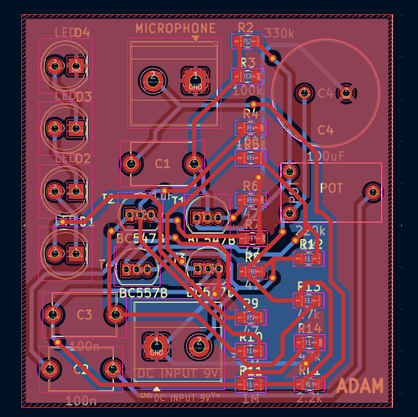

# Sound-To-Light PCB

This repository contains the hardware design files for a **Sound-To-Light** circuit.  
The board captures an audio signal and converts it into a visual response using LEDs, where the light intensity reacts to the sound level.

---

## 📸 Board Preview

### 3D View

### PCB Layout

### Schematic
---

## 🛠 Tools Used

- **KiCad** – Schematic capture and PCB layout
- **Standard PCB manufacturing tools** – Gerber generation
- **Lab equipment** – Functional testing (audio source, oscilloscope, LEDs, power supply)

---

## ✅ Results

- Adjustable sound sensitivity
- Audio input is successfully detected and processed
- LEDs respond correctly to sound intensity
- PCB works as expected after assembly
- Stable operation with no observed functional issues

---

##  What I Learned

Through this project, I gained practical experience in:

- Designing analog circuits for audio signal processing
- Converting audio signals into visual outputs using LEDs
- PCB schematic capture and layout using KiCad
- Generating Gerber files for PCB ordering of manufacturing
- Testing and debugging hardware using lab equipment
- Improving PCB functionality through iteration and validation

This project strengthened my understanding of the complete hardware design flow, from concept to a working PCB.

---

## 🚀 Getting Started

### Manufacturing
Use the Gerber files inside `Light to sound.zip` to order the PCB from any manufacturer.

### Viewing or Modifying the Design
Open the schematic and PCB layout files using compatible ECAD software.

